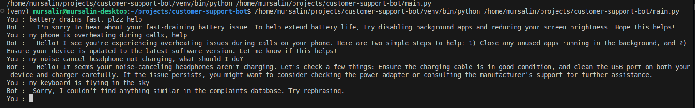

# 🤖 Customer Support Bot (Ollama + Supabase)

A smart, vector-based customer support chatbot that helps users resolve complaints using semantic search and AI.

---

## 🚀 Features

- Accepts user input and embeds it using `paraphrase-MPNet-base-v2`
- Performs vector similarity search on past complaints
- Uses the most relevant match as context to generate a helpful AI response
- Saves all conversations to a chat history table
- CLI-based interaction (can be extended to Gradio or web UI, welcome to contribute)

---

## 🧠 Technologies Used

- Python
- Ollama (LLM: Mistral 7B)
- Supabase (Cloud PostgreSQL with `pgvector`)
- SentenceTransformers (`paraphrase-MPNet-base-v2`)
- psycopg2

---

## 💬 Sample Interaction with Chatbot

